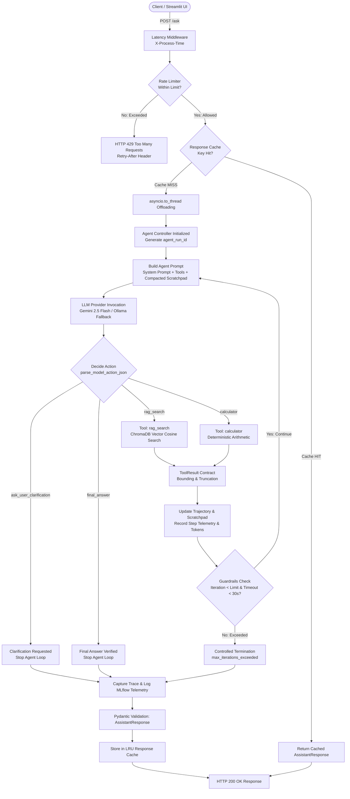

# AI Assistant — Production-Grade Multi-Provider Agentic MLOps System

A production-grade, resilient, multi-provider AI Assistant backend, interactive web interface, and **Week 17 Track B Agentic MLOps** platform built with **FastAPI**, **Streamlit**, **Pydantic v2**, **Google Gemini 2.5 Flash**, **ChromaDB**, **Astral `uv`**, **MLflow**, and **Evidently AI**.

---

## 1. Project Overview

The **AI Assistant** provides an end-to-end intelligent question-answering, multi-step research, and computing system designed for production readiness, fault tolerance, developer extensibility, and verifiable safety.

In **Week 17 Track B**, the system is augmented with an enterprise MLOps lifecycle:
* **Dependency Management via `uv`**: Fully reproducible, cryptographically locked builds.
* **MLflow Experiment Tracking**: Automated parameter, metric, and artifact logging for $\ge 3$ distinct configuration and prompt versions.
* **Full Agent Trace Logging**: Detailed step-by-step observable trajectory and tool telemetry with credential redaction.
* **Evidently AI Regression Testing**: Data drift detection, automated test suites, custom agentic performance metrics, and standalone interactive HTML dashboards.
* **Unified Multi-Version Benchmark Runner**: Single-command execution and cross-version regression evaluation.

---

## 2. Existing W15/W16 Agent

The existing W15 and W16 foundational agent capabilities remain intact and fully functional:
* **Bounded ReAct Reasoning Loop**: Dynamic reasoning engine executing multi-step tool calls, reformulating queries, requesting user clarification, and stopping under strict iteration/timeout bounds.
* **Provider-Agnostic Tool Registry**: Modular tool registry exposing vector search (`rag_search`), deterministic arithmetic math (`calculator`), and ambiguity clarification (`ask_user_clarification`).
* **Context Engineering & Scratchpad**: Observation bounding (max 400 chars/chunk, max 1200 chars/obs) and older-step compaction to eliminate token bloat.
* **Fault Recovery & Resilience**: Query reformulation on empty retrieval, argument correction on math errors, cascading error recovery, and safe budget exhaustion.
* **Production Middleware**: Sliding-window rate limiting per IP, thread-safe LRU response caching with TTL, exponential backoff retries, and automatic fallback from Gemini to local Ollama.

---

## 3. Week 17 Track B MLOps Objective

The Week 17 Track B objective is to establish a rigorous, reproducible MLOps platform for agentic LLM systems:
1. **Track Experimentation**: Quantify the impact of prompt engineering, temperature variation, iteration limits, and RAG chunking parameters.
2. **Ensure Traceability**: Capture end-to-end agent decision-making traces for every query without storing private chain-of-thought reasoning tokens.
3. **Prevent Functional Regressions**: Automatically detect regressions, quality degradation, and cost inflation between candidate prompt/configuration versions using Evidently AI.
4. **Maintain Absolute Reproducibility**: Guarantee deterministic dependency resolution and push-button evaluation.

---

## 4. Architecture

### System Architecture Flowchart



---

## 5. Repository Structure

```text
ai-assistant/
├── pyproject.toml                   # PEP 621 project & uv dependency specifications
├── uv.lock                          # Pinned, cryptographically locked dependency graph
├── .env.example                     # Environment template with configuration parameters
├── .gitignore                       # Clean git ignore policy (.env, mlruns, *.db ignored)
├── Dockerfile                       # Production Docker container specification (uv-enabled)
├── docker-compose.yml               # Multi-container Docker Compose orchestration
├── requirements.txt                 # Legacy requirements compatibility reference
├── docs/
│   └── week17_track_b_compliance.md # Requirement-by-requirement verification matrix
├── reports/                         # Generated MLOps Reports
│   └── evidently/                   # Interactive Evidently AI HTML & JSON/MD Reports
│       ├── v1_baseline_vs_v1_baseline.html
│       ├── v2_compact_precision_vs_v1_baseline.html
│       └── v3_deep_validation_vs_v1_baseline.html
├── app/
│   ├── __init__.py                  # Application package root
│   ├── config.py                    # Centralized settings & MLflow parameter export
│   ├── main.py                      # FastAPI app, latency middleware, and routes
│   ├── cache.py                     # Thread-safe in-memory LRU response cache with TTL
│   ├── rate_limiter.py              # In-memory sliding-window IP rate limiter
│   ├── llm.py                       # Multi-provider LLM router & retry policy
│   ├── tools.py                     # Deterministic arithmetic calculator implementation
│   ├── prompts.py                   # Canonical system prompt versions
│   ├── mlops/                       # Week 17 MLOps Subsystem
│   │   ├── __init__.py              # MLOps package root & clean exports
│   │   ├── config_versions.py       # 3 Canonical agent configuration versions
│   │   ├── trace_schema.py          # Trace schema models & secret sanitization
│   │   ├── mlflow_tracking.py       # MLflow run setup, metric, param, and artifact logger
│   │   ├── evidently_monitoring.py  # Evidently AI regression suite & custom metric engine
│   │   └── eval_runner.py           # Multi-version benchmark evaluator & runner CLI
│   ├── agent/                       # W16 Agent Subsystem
│   │   ├── __init__.py              # Agent package root
│   │   ├── tools.py                 # ToolRegistry, ToolResult contract, and tool implementations
│   │   ├── context.py               # AgentState, TrajectoryStep, truncation, and compaction
│   │   ├── engine.py                # ReAct agent loop, duplicate guard, timeout, and dispatcher
│   │   └── metrics.py               # Observability, token accounting, and failure logs
│   └── rag/                         # RAG Subsystem
│       ├── __init__.py              # RAG package root
│       ├── ingest.py                # Document chunking, embedding, and ChromaDB indexing
│       ├── embeddings.py            # Gemini text-embedding-004 integration
│       └── retrieve.py              # Vector similarity search over ChromaDB
├── documents/
│   └── sample.txt                   # Knowledge base document
├── tests/
│   ├── __init__.py                  # Test package root
│   ├── test_config.py               # Centralized settings & MLflow parameter export tests
│   ├── test_mlflow_tracking.py      # MLflow tracking, versioning & runner tests
│   ├── test_tracing.py              # Full agent trace logging & telemetry tests
│   ├── test_evidently_monitoring.py # Evidently AI regression suite & metric calculation tests
│   ├── test_cache.py                # W15: Response cache & TTL tests
│   ├── test_fallback.py             # W15: Gemini -> Ollama fallback tests
│   ├── test_rate_limit.py           # W15: Sliding-window rate limit tests
│   ├── test_retry.py                # W15: Bounded retries & quota protection tests
│   ├── test_concurrency.py          # W15: Latency middleware & concurrency benchmarks
│   ├── test_agent_tools.py          # W16: Tool registry & tool contract tests
│   ├── test_agent_context.py        # W16: Context engineering & scratchpad compaction tests
│   ├── test_agent_engine.py         # W16: Agent loop, tool chaining, & guardrail tests
│   ├── test_agent_api_and_observability.py # W16: FastAPI, cache, & observability tests
│   ├── test_evaluation_harness.py   # W16: Evaluation metric & classification unit tests
│   ├── test_agent_evaluation_benchmark.py  # W16: Full 16-case benchmark execution test
│   ├── test_failure_injection.py    # W16: Fault recovery & failure injection tests
│   └── evaluation/                  # Evaluation Harness Subsystem
│       ├── __init__.py              # Evaluation package root
│       ├── benchmark_cases.py       # 16 curated benchmark cases across 6 categories
│       ├── evaluator.py             # Benchmark runner, metric calculator, & report generator
│       ├── failure_injection.py     # Failure injection cases, runner, & fault report generator
│       └── results/                 # Persisted Evaluation Reports
│           ├── agent_evaluation_results.md
│           ├── benchmark_results_v1_baseline.md
│           ├── benchmark_results_v2_compact_precision.md
│           ├── benchmark_results_v3_deep_validation.md
│           └── failure_injection_results.md
└── ui/
    └── app.py                       # Streamlit interactive web application
```

---

## 6. Environment Setup with `uv`

The project uses [**`uv`**](https://github.com/astral-sh/uv) (by Astral) for deterministic dependency resolution:

```bash
# 1. Install uv (if not already installed)
curl -LsSf https://astral.sh/uv/install.sh | sh

# 2. Clone the repository and navigate into it
cd ai-assistant

# 3. Synchronize virtual environment from uv.lock
uv sync

# 4. Configure environment variables
cp .env.example .env
# Edit .env and supply your GEMINI_API_KEY
```

---

## 7. Configuration

All configuration is managed centrally through Pydantic Settings in [`app/config.py`](file:///home/himalbhandari/ai-assistant/app/config.py):
* **`LLM_PROVIDER`**: Active LLM provider (`gemini`, `ollama`, `vllm`).
* **`GEMINI_API_KEY`**: Google Gemini API key.
* **`PROMPT_VERSION`**: Active system prompt tag (`w16_react_v1`, `w17_compact_precision_v2`, `w17_deep_validation_v3`).
* **`AGENT_TEMPERATURE`**: Agent sampling temperature (`0.1`, `0.0`, `0.3`).
* **`AGENT_MAX_ITERATIONS`**: Maximum reasoning iterations (`5`, `4`, `6`).
* **`CHUNK_SIZE` / `CHUNK_OVERLAP` / `RAG_TOP_K`**: RAG indexing and retrieval parameters.
* **`MAX_CHUNK_CHARS` / `MAX_OBSERVATION_CHARS` / `MAX_DETAILED_STEPS`**: Scratchpad observation bounding budgets.

---

## 8. Running the Agent

### Ingest Knowledge Base
```bash
uv run python -m app.rag.ingest
```

### Option A: Local Execution
```bash
# Terminal 1: Launch FastAPI Backend
uv run uvicorn app.main:app --host 0.0.0.0 --port 8000 --reload

# Terminal 2: Launch Streamlit Web UI
uv run streamlit run ui/app.py
```
* **FastAPI Backend**: `http://localhost:8000` (Docs: `http://localhost:8000/docs`)
* **Streamlit Web UI**: `http://localhost:8501`

### Option B: Docker Compose Execution
```bash
docker compose up --build
```

---

## 9. Running Tests

Run the full automated test suite (99 unit and integration tests):
```bash
uv run pytest -v
```

To run specific test groups:
```bash
# Centralized configuration tests
uv run pytest tests/test_config.py -v

# MLflow tracking and versioning tests
uv run pytest tests/test_mlflow_tracking.py -v

# Agent trace schema and credential sanitization tests
uv run pytest tests/test_tracing.py -v

# Evidently AI regression suite and custom metrics tests
uv run pytest tests/test_evidently_monitoring.py -v

# Fault recovery and failure injection tests
uv run pytest tests/test_failure_injection.py -v
```

---

## 10. MLflow Experiment Tracking

The project uses MLflow with SQLite backend and local artifact storage:
* **Experiment Name**: `week17-track-b-agentic-mlops`
* **Backend Store URI**: `sqlite:///mlflow.db`
* **Artifact Store**: `./mlruns`
* **Tracked Parameters**: `version_id`, `prompt_version`, `model`, `temperature`, `max_iterations`, `chunk_size`, `chunk_overlap`, `top_k`, `max_chunk_chars`, `max_observation_chars`, `max_detailed_steps`, `fallback_enabled`.
* **Tracked Metrics**: `task_completion_rate`, `tool_call_correctness`, `avg_trajectory_length`, `avg_tokens_per_query`, `total_tokens`, `pct_tests_passed`, `regression_detected`, `trajectory_efficiency_score`, `token_cost_ratio`, `hard_failures`, `soft_failures`, `cascading_soft_failures`.

---

## 11. The 3 Configuration Versions

The system defines 3 canonical prompt and configuration versions in [`app/mlops/config_versions.py`](file:///home/himalbhandari/ai-assistant/app/mlops/config_versions.py):

| Version ID | Prompt Version Tag | Temp | Max Iter | Chunk Size | Top-K | Key Characteristics |
| :--- | :--- | :---: | :---: | :---: | :---: | :--- |
| **`v1_baseline`** | `w16_react_v1` | `0.1` | `5` | `1000` | `3` | Standard ReAct baseline configuration with structured multi-step reasoning. |
| **`v2_compact_precision`** | `w17_compact_precision_v2` | `0.0` | `4` | `800` | `4` | Deterministic greedy sampling, concise prompt, granular chunking, token efficiency. |
| **`v3_deep_validation`** | `w17_deep_validation_v3` | `0.3` | `6` | `1200` | `2` | Exploratory sampling, multi-hop independent fact retrieval, deep cross-verification. |

---

## 12. Evaluation Benchmark

The evaluation suite uses the fixed 16-case benchmark in [`tests/evaluation/benchmark_cases.py`](file:///home/himalbhandari/ai-assistant/tests/evaluation/benchmark_cases.py):
* **Direct Single-Step RAG Retrieval** (`RAG-01` to `RAG-03`)
* **Multi-Hop RAG Retrieval** (`MHOP-01` to `MHOP-03`)
* **Ambiguity Clarification** (`AMBIG-01` to `AMBIG-03`)
* **Deterministic Arithmetic Math** (`MATH-01` to `MATH-02`)
* **Hybrid Multi-Step Reasoning** (`HYBRID-01` to `HYBRID-03`)
* **Guardrail & Edge Cases** (`GUARD-01` to `GUARD-02`)

---

## 13. Agent Trace Logging

Detailed execution traces are captured for every query without storing private chain-of-thought reasoning tokens ([`app/mlops/trace_schema.py`](file:///home/himalbhandari/ai-assistant/app/mlops/trace_schema.py)):
* **Trace Schema**: Query, configuration version, decision iterations, tool calls, tool arguments, observations, latency, prompt/completion tokens, error recovery, and termination status.
* **Credential Redaction**: Automatic sanitization (`[REDACTED]`) of API keys, bearer tokens, passwords, and authorization headers in `sanitize_trace_payload`.
* **Artifact Output**:
  - `traces/<case_id>.json`: Structured JSON for every benchmark case.
  - `traces/all_traces.jsonl`: Line-delimited JSONL file containing all executed traces.
  - `traces/representative_traces.json`: Categorized showcase traces.
  - `traces/traces_summary.md`: Human-readable summary table and query breakdown.

---

## 14. Evidently Regression Testing

Automated regression and data drift testing is implemented in [`app/mlops/evidently_monitoring.py`](file:///home/himalbhandari/ai-assistant/app/mlops/evidently_monitoring.py):
* **Evidently Version**: `evidently==0.7.23`
* **Test Suite**: `TestSuite` executing `DataDriftTestPreset`, null column checks, drifted column share checks, and column value bounds on `task_success`, `tool_call_correctness`, `step_count`, `total_tokens`, and `duration_seconds`.
* **HTML Dashboard**: Standalone interactive reports generated in `reports/evidently/<version>_vs_v1_baseline.html` and saved as MLflow artifacts.

---

## 15. Regression Metrics and Thresholds

### Custom Metric Formulas
* **Benchmark Pass Rate**: $\text{Pass Rate} = \frac{\text{Passed Cases}}{\text{Total Cases}} \times 100\%$
* **Trajectory Efficiency Score (TES)**: $\text{TES} = \frac{\text{Task Completion Rate (TCR)}}{\text{Average Trajectory Length (steps)}}$
* **Token Cost Ratio**: $\text{Cost Ratio} = \frac{\text{Current Total Tokens}}{\text{Reference Total Tokens}}$

### Explicit Regression Thresholds

| Metric / Boundary | Threshold Rule | Status |
| :--- | :---: | :---: |
| **Benchmark Pass Rate** | $\ge 95.0\%$ | Enforced |
| **Task Completion Rate (TCR)** | $\ge 95.0\%$ | Enforced |
| **Tool-Call Correctness (TCC)** | $\ge 95.0\%$ | Enforced |
| **Max Trajectory Growth Multiplier** | $\le 1.50\times$ | Enforced |
| **Max Token Growth Multiplier** | $\le 1.75\times$ | Enforced |
| **Max Allowable Hard Failures** | $\le 0$ | Enforced |

---

## 16. MLflow Artifact Structure

For every configuration version evaluated, artifacts are saved under `evaluation/`:
```text
mlruns/1/<run_id>/artifacts/
├── evaluation/
│   ├── config.json                        # Full configuration snapshot
│   ├── summary.json                       # Benchmark metrics summary JSON
│   ├── results.json                       # Full case-by-case evaluation results
│   ├── results.csv                        # Tabular CSV export of results
│   ├── evaluation_report.md               # Formatted markdown report
│   ├── benchmark_cases.json               # Input benchmark specification
│   ├── traces/                            # Complete execution trace telemetry
│   │   ├── case_calc_01.json ...          # Individual trace files (16 cases)
│   │   ├── all_traces.jsonl               # Line-delimited trace file
│   │   ├── representative_traces.json     # Showcase trace examples
│   │   └── traces_summary.md              # Markdown summary of traces
│   └── evidently/                         # Evidently AI regression artifacts
│       ├── <version>_vs_v1_baseline.html  # Interactive standalone HTML dashboard
│       ├── <version>_regression_summary.json
│       └── <version>_regression_summary.md
```

---

## 17. Viewing MLflow UI

Launch the MLflow tracking UI:
```bash
uv run mlflow ui --backend-store-uri sqlite:///mlflow.db --port 5000
```
Open `http://localhost:5000` in your browser to:
* Compare runs across versions (`v1_baseline`, `v2_compact_precision`, `v3_deep_validation`).
* Inspect parameter diffs and metric charts (TCR, TCC, TES, Token Cost Ratio).
* View and download artifacts (`traces/`, `evidently/*.html`, `summary.json`).

---

## 18. Reproducing the Full Evaluation

Execute the complete end-to-end evaluation pipeline with a single command:
```bash
# Evaluate all 3 versions, capture traces, run Evidently monitoring, and log to MLflow:
uv run python -m app.mlops.eval_runner --version all

# Or evaluate a single version:
uv run python -m app.mlops.eval_runner --version v1_baseline
uv run python -m app.mlops.eval_runner --version v2_compact_precision
uv run python -m app.mlops.eval_runner --version v3_deep_validation
```

---

## 19. Results

Actual measured results from the multi-version benchmark evaluation:

| Metric | `v1_baseline` (Ref) | `v2_compact_precision` | `v3_deep_validation` |
| :--- | :---: | :---: | :---: |
| **Prompt Version** | `w16_react_v1` | `w17_compact_precision_v2` | `w17_deep_validation_v3` |
| **Sampling Temperature** | `0.1` | `0.0` | `0.3` |
| **Task Completion Rate (TCR)** | **100.0%** (16/16) | **100.0%** (16/16) | **100.0%** (16/16) |
| **Tool-Call Correctness (TCC)** | **100.0%** (19/19) | **100.0%** (17/17) | **100.0%** (22/22) |
| **Benchmark Pass Rate** | **100.0%** | **100.0%** | **100.0%** |
| **Average Trajectory Length** | `2.12 steps` | `1.94 steps` | `2.25 steps` |
| **Average Tokens per Query** | `153.5 tokens` | `105.8 tokens` | `186.3 tokens` |
| **Trajectory Efficiency Score** | `47.17` | `51.55` | `44.44` |
| **Token Cost Ratio** | `1.000x` | `0.689x` (-31.1%) | `1.214x` (+21.4%) |
| **Evidently Regression Status** | ✅ **Passed** | ✅ **Passed** | ✅ **Passed** |

---

## 20. Limitations

1. **LLM Provider Quota & Latency**: Google Gemini 2.5 Flash operates with remote API quotas; local Ollama fallback requires sufficient local GPU/CPU compute.
2. **Knowledge Base Scope**: RAG knowledge base is currently built from `documents/sample.txt`; expanding the corpus requires running `uv run python -m app.rag.ingest`.
3. **Deterministic Math Sandbox**: The calculator tool evaluates arithmetic expressions with `ast.parse` and operator whitelisting; non-arithmetic code execution is disallowed by design.

---

## 21. Airflow Orchestration (Optional)

* **Status**: **Optional — Not Implemented** in this submission.
* **Architecture Design**: The evaluation runner ([`app/mlops/eval_runner.py`](file:///home/himalbhandari/ai-assistant/app/mlops/eval_runner.py)) is decoupled into a standalone CLI module (`uv run python -m app.mlops.eval_runner --version all`). It is fully compatible with Apache Airflow `BashOperator` or `PythonOperator` for scheduled regression checks in production CI/CD pipelines without modifying internal agent code.
