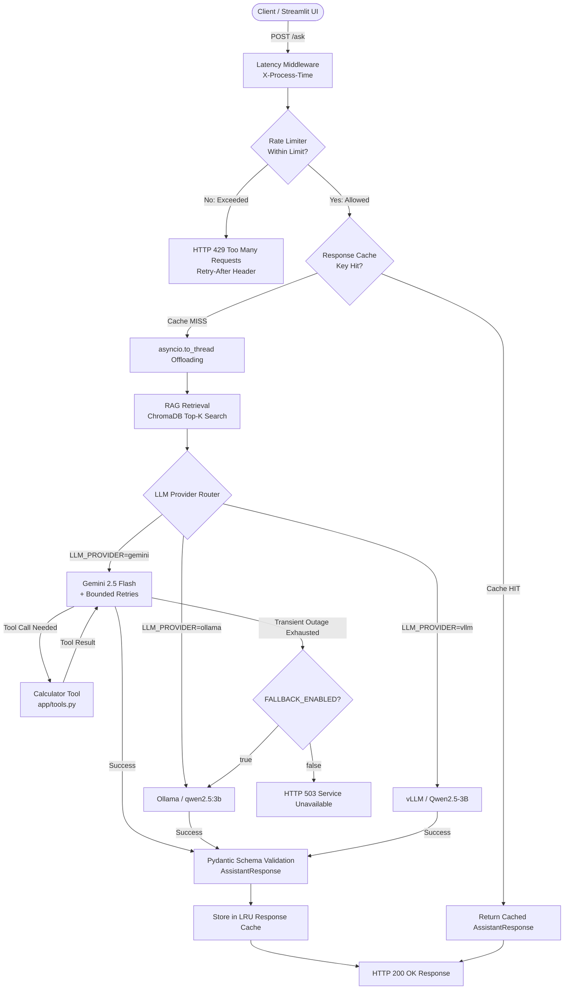

# AI Assistant — Production-Grade Multi-Provider System

A modular, resilient, high-performance AI Assistant backend and web interface built with **FastAPI**, **Streamlit**, **Pydantic**, **Google Gemini**, **ChromaDB**, **Ollama**, **vLLM**, and **Docker**.

---

## 1. System Overview

The **AI Assistant** is an end-to-end intelligent question-answering and computing system designed for production readiness, fault tolerance, and developer extensibility.

### Core Capabilities
* **Interactive Web Interface**: Clean Streamlit UI with real-time feedback, topic badges, and graceful error presentation.
* **Asynchronous ASGI Backend**: Non-blocking FastAPI core offloading heavy I/O and inference to threadpools via `asyncio.to_thread`.
* **Multi-Provider LLM Abstraction**: Seamless integration with Google Gemini 2.5, local Ollama (`qwen2.5:3b`), and local vLLM OpenAI-compatible servers.
* **Retrieval-Augmented Generation (RAG)**: Ingests documents, splits text into overlapping chunks, generates vector embeddings (`text-embedding-004`), and searches persistent ChromaDB vector storage using cosine similarity.
* **Deterministic Tool Calling**: Native calculator function calling for accurate arithmetic computations.
* **Predictable Structured Outputs**: Enforces Pydantic schema validation (`answer`, `topic`) across all providers.
* **In-Memory Rate Limiting**: Sliding-window rate limiter per client IP protecting against request bursts before invoking any AI/RAG resources.
* **In-Memory Response Caching**: Thread-safe LRU cache with TTL expiration and provider isolation to eliminate redundant LLM inference.
* **Bounded Retries & Quota Protection**: Exponential backoff retries for transient outages (max 2 retries / 3 attempts) while failing immediately on HTTP 429 quota exhaustion to preserve free-tier limits.
* **Automated Fallback Routing**: Automatic single-level fallback from Gemini to local Ollama on eligible transient failures with full RAG context preservation.
* **Docker Containerization**: Production Dockerfile and Docker Compose orchestration with automated health checks and persistent volume mounts.

---

## 2. End-to-End System Architecture

```text
                                  User / Client
                                        │
                         ┌──────────────┴──────────────┐
                         │                             │
                         ▼                             ▼
              Streamlit Web UI (`:8501`)      cURL / External Client
                         │                             │
                         │ HTTP POST /ask              │ HTTP POST /ask
                         └──────────────┬──────────────┘
                                        ▼
                   ┌─────────────────────────────────────────┐
                   │    FastAPI ASGI Backend (`:8000`)       │
                   │                                         │
                   │  1. Latency Middleware (X-Process-Time) │
                   │  2. In-Memory Rate Limiter (Sliding Win)│
                   │  3. In-Memory Response Cache (LRU+TTL)  │
                   └────────────────────┬────────────────────┘
                                        │ (Cache Miss)
                                        ▼
                        asyncio.to_thread Offloading
                                        │
                                        ▼
                   ┌─────────────────────────────────────────┐
                   │       RAG Retrieval Subsystem           │
                   │                                         │
                   │  1. Question Embedding (text-embed-004) │
                   │  2. ChromaDB Cosine Search (Top-K)      │
                   │  3. Context Augmentation                │
                   └────────────────────┬────────────────────┘
                                        │ (Retrieved Context)
                                        ▼
                   ┌─────────────────────────────────────────┐
                   │        Multi-Provider LLM Router        │
                   └────────────────────┬────────────────────┘
                                        │
           ┌────────────────────────────┼────────────────────────────┐
           │                            │                            │
           ▼ (Primary)                  ▼ (Local)                    ▼ (Local)
   Google Gemini 2.5             Local Ollama Server          Local vLLM Server
   (gemini-2.5-flash)               (qwen2.5:3b)            (Qwen2.5-3B-Instruct)
           │                            │                            │
   [Bounded Retries]                    │                            │
   (Max 2 retries)                      │                            │
           │                            │                            │
           ├─► Calculator Tool          │                            │
           │   (`app/tools.py`)         │                            │
           │                            │                            │
           ▼ (Eligible Failure)         │                            │
   [Automated Fallback] ───────────────►│                            │
                                        │                            │
           └────────────────────────────┼────────────────────────────┘
                                        │
                                        ▼
                   ┌─────────────────────────────────────────┐
                   │      Pydantic Schema Validation         │
                   │   `AssistantResponse(answer, topic)`    │
                   └────────────────────┬────────────────────┘
                                        │
                                        ├─► Store in Response Cache
                                        │
                                        ▼
                             Structured JSON Response
                                 (HTTP 200 OK)
```

### Architecture Flow Diagram (Mermaid)



---

## 3. Technology Stack

| Component | Technology | Purpose |
|---|---|---|
| **Web UI** | [Streamlit](https://streamlit.io/) 1.32+ | Interactive browser frontend |
| **API Framework** | [FastAPI](https://fastapi.tiangolo.com/) 0.110+ | High-performance asynchronous REST API |
| **ASGI Server** | [Uvicorn](https://www.uvicorn.org/) 0.29+ | Production ASGI web server |
| **Data Validation** | [Pydantic v2](https://docs.pydantic.dev/) | Strict request/response schema modeling |
| **Cloud LLM SDK** | [Google GenAI SDK](https://github.com/googleapis/python-genai) (`google-genai`) | Gemini 2.5 Flash and text-embedding-004 |
| **Local LLM Engines** | [Ollama](https://ollama.com/) & [vLLM](https://github.com/vllm-project/vllm) | Open-source Qwen 2.5:3B local inference |
| **Vector Database** | [ChromaDB](https://www.trychroma.com/) 0.5+ | Persistent local vector store with cosine search |
| **HTTP Clients** | `httpx` & `requests` | Async & sync outbound API requests |
| **Containerization** | Docker & Docker Compose | Container packaging and multi-service deployment |

---

## 4. Project Structure

```text
ai-assistant/
├── app/
│   ├── __init__.py          # Application package root
│   ├── main.py              # FastAPI async app, routes, middleware, and exception handlers
│   ├── cache.py             # In-memory thread-safe LRU response cache with TTL expiration
│   ├── rate_limiter.py      # In-memory sliding-window IP rate limiter with Retry-After
│   ├── llm.py               # Multi-provider LLM router, retry policy, and fallback orchestration
│   ├── tools.py             # Deterministic arithmetic calculator tool
│   ├── prompts.py           # Structured system instructions and prompt templates
│   └── rag/
│       ├── __init__.py      # RAG package root
│       ├── ingest.py        # Document ingestion, text chunking, and ChromaDB indexing
│       ├── embeddings.py    # Google text-embedding-004 integration
│       └── retrieve.py      # Vector similarity search and context formatting
├── data/
│   ├── embeddings.json      # Cached embedding vectors
│   └── chroma/              # Persistent ChromaDB SQLite and parquet index
├── documents/
│   └── sample.txt           # Sample knowledge base document
├── tests/
│   ├── __init__.py          # Test suite package root
│   ├── test_cache.py        # Unit & integration tests for response cache & TTL
│   ├── test_fallback.py     # Unit & integration tests for Gemini -> Ollama fallback
│   ├── test_rate_limit.py   # Unit & integration tests for sliding-window rate limiting
│   ├── test_retry.py        # Unit & integration tests for bounded retries & quota protection
│   └── test_concurrency.py  # Latency middleware and concurrent execution benchmark
├── ui/
│   └── app.py               # Streamlit web interface application
├── .dockerignore            # Docker build exclusion rules
├── .env.example             # Documented environment variable template
├── .env                     # Local environment settings (gitignored)
├── .gitignore               # Git secret and build artifact exclusions
├── Dockerfile               # Multi-service container specification
├── docker-compose.yml       # Production Docker Compose orchestration
├── requirements.txt         # Pinned Python package dependencies
└── README.md                # Comprehensive documentation
```

---

## 5. Prerequisites & Environment Setup

### Prerequisites
* **Python**: 3.11 or 3.12
* **Docker & Docker Compose** (for containerized execution)
* **Google Gemini API Key** (for cloud LLM and embedding features)
* **Ollama** (optional, for local model inference with `qwen2.5:3b`)

### Configuration (`.env`)
Create your `.env` file by copying `.env.example`:

```bash
cp .env.example .env
```

| Variable | Default Value | Description |
|---|---|---|
| `LLM_PROVIDER` | `gemini` | Primary active LLM provider (`gemini`, `ollama`, `vllm`) |
| `GEMINI_API_KEY` | `your_gemini_api_key_here` | Google AI Studio API key |
| `GEMINI_MODEL` | `gemini-2.5-flash` | Gemini model name |
| `GEMINI_EMBEDDING_MODEL` | `text-embedding-004` | Gemini vector embedding model |
| `CHUNK_SIZE` | `1000` | Text chunk character length |
| `CHUNK_OVERLAP` | `100` | Overlap character length between chunks |
| `RAG_TOP_K` | `3` | Number of relevant chunks retrieved per query |
| `CHROMA_PATH` | `data/chroma` | Persistent ChromaDB storage path |
| `OLLAMA_BASE_URL` | `http://localhost:11434` | Ollama server URL |
| `OLLAMA_MODEL` | `qwen2.5:3b` | Ollama model identifier |
| `OLLAMA_TIMEOUT` | `120.0` | Ollama HTTP request timeout in seconds |
| `VLLM_BASE_URL` | `http://localhost:8001/v1` | vLLM OpenAI-compatible endpoint URL |
| `VLLM_MODEL` | `Qwen/Qwen2.5-3B-Instruct` | vLLM model identifier |
| `VLLM_TIMEOUT` | `120.0` | vLLM HTTP request timeout in seconds |
| `BACKEND_URL` | `http://localhost:8000` | Backend API URL for Streamlit UI |
| `RATE_LIMIT_REQUESTS` | `10` | Max requests allowed per window per IP |
| `RATE_LIMIT_WINDOW_SECONDS` | `60` | Rolling window duration in seconds |
| `FALLBACK_ENABLED` | `true` | Enable/disable automatic provider fallback |
| `FALLBACK_PROVIDER` | `ollama` | Fallback target provider (`ollama`, `vllm`) |
| `CACHE_ENABLED` | `true` | Enable/disable in-memory response cache |
| `CACHE_TTL_SECONDS` | `300` | Cache time-to-live in seconds (5 min) |
| `CACHE_MAX_SIZE` | `100` | Max entries in LRU response cache |

---

## 6. Local Installation & Development

### 1. Create and Activate Virtual Environment
```bash
python3 -m venv .venv
source .venv/bin/activate
pip install --upgrade pip
pip install -r requirements.txt
```

### 2. Ingest RAG Knowledge Documents
Index documents located in `documents/` into ChromaDB:
```bash
python -m app.rag.ingest
```

### 3. Launch FastAPI Backend
```bash
uvicorn app.main:app --host 0.0.0.0 --port 8000 --reload
```
* **API Server**: `http://localhost:8000`
* **Interactive API Docs (Swagger UI)**: `http://localhost:8000/docs`
* **Alternative API Docs (ReDoc)**: `http://localhost:8000/redoc`

### 4. Launch Streamlit Web UI
In a separate terminal (with `.venv` activated):
```bash
streamlit run ui/app.py
```
* **Web UI URL**: `http://localhost:8501`

---

## 7. RAG Pipeline & Ingestion Workflow

```text
documents/sample.txt
         │
         ▼
Text Chunking (`CHUNK_SIZE=1000`, `CHUNK_OVERLAP=100`)
         │
         ▼
Vector Embeddings (`text-embedding-004` via Google GenAI)
         │
         ▼
ChromaDB Persistent Collection (`data/chroma`)
         │
   [Query Phase]
         │
Question Embedding ──► Cosine Similarity Search (Top-3) ──► Augmented Prompt Context
```

* **Ingestion Script**: [`app/rag/ingest.py`](file:///home/himalbhandari/ai-assistant/app/rag/ingest.py) reads `.txt` documents, applies deterministic sliding-window chunking, generates embeddings in batches, and upserts them into ChromaDB.
* **Embeddings**: [`app/rag/embeddings.py`](file:///home/himalbhandari/ai-assistant/app/rag/embeddings.py) interfaces with `text-embedding-004`.
* **Retrieval**: [`app/rag/retrieve.py`](file:///home/himalbhandari/ai-assistant/app/rag/retrieve.py) queries ChromaDB for the Top-K most relevant chunks and constructs clean context blocks.

---

## 8. Asynchronous Request Handling & Concurrency

### Non-Blocking Event Loop Design
The FastAPI endpoint `/ask` is declared as an asynchronous coroutine (`async def ask_question`). Synchronous operations (such as disk I/O for ChromaDB and blocking HTTP inference requests) are offloaded to Python's background threadpool using `asyncio.to_thread`:

```python
response = await asyncio.to_thread(get_llm_response, payload.question)
```

This prevents the ASGI event loop from blocking and enables FastAPI to concurrently accept, process, and complete incoming requests.

### Latency Measurement Middleware
Every request is automatically intercepted by the `measure_request_latency` middleware:
* Calculates precise elapsed time using high-resolution `time.perf_counter()`.
* Adds the `X-Process-Time` HTTP response header (e.g. `X-Process-Time: 0.2050s`).
* Emits structured server access logs with method, path, latency, and status code.

### Concurrency Benchmark
Run the automated benchmark suite:
```bash
python tests/test_concurrency.py
```

#### Observed Benchmark Results (Sample Size = 4 requests)
| Mode | Total Time | Average Latency | Throughput | Speedup |
|---|---|---|---|---|
| **Sequential** | `0.8436s` | `0.2109s` | `4.74 req/s` | 1.0x (Baseline) |
| **Concurrent (`asyncio.gather`)** | `0.2133s` | `0.2104s` | `18.75 req/s` | **3.95x Faster** |

> **Note**: These measurements reflect local concurrent execution and demonstrate non-blocking scheduling under load.

---

## 9. Reliability, Bounded Retries & Error Handling

### Retry Policy
All upstream LLM inference calls are guarded by `execute_with_retry`:
* **Maximum Retries**: 2 retries (strictly capped at **3 total attempts**).
* **Backoff Formula**: `delay = base_delay * (2 ** attempt)` (default `0.5s` -> `1.0s`).

### Transient vs Non-Transient Classification
| Category | Exception Types / Conditions | Behavior |
|---|---|---|
| **Transient (Retryable)** | `ConnectError`, `TimeoutException`, `ReadTimeout`, `ConnectionResetError`, HTTP 500, 502, 503, 504 | Retried up to 2 times with exponential delay |
| **Quota Exhaustion (Non-Retryable)** | HTTP 429, `ResourceExhausted`, `quota` errors | **Fails immediately on attempt 1 (0 retries)** to protect Gemini free-tier quota |
| **Authentication / Config (Non-Retryable)** | HTTP 401, 403, `API_KEY` missing/invalid | **Fails immediately on attempt 1 (0 retries)** |
| **Validation / Input (Non-Retryable)** | `ValueError`, `ValidationError`, empty inputs | **Fails immediately on attempt 1 (0 retries)** |

### Graceful HTTP Error Mapping
* **HTTP 422**: Empty, whitespace-only, or invalid schema requests.
* **HTTP 429**: Upstream quota exhaustion or local rate limit violation.
* **HTTP 503**: Upstream provider unavailable after retries (or both primary and fallback failed).
* **HTTP 502**: Upstream authentication / gateway failure.
* **HTTP 500**: Safe internal server error (never leaks internal secrets or raw stack traces).

---

## 10. In-Memory API Rate Limiting

### Sliding Window Algorithm
The backend incorporates an in-memory sliding-window rate limiter per client IP ([`app/rate_limiter.py`](file:///home/himalbhandari/ai-assistant/app/rate_limiter.py)):
* **Default Limits**: 10 requests per 60-second rolling window (`RATE_LIMIT_REQUESTS=10`, `RATE_LIMIT_WINDOW_SECONDS=60`).
* **Client IP Identification**: Checks `X-Forwarded-For` proxy headers first, falling back to direct socket client IP (`request.client.host`).
* **Concurrency Safety**: Synchronized using `asyncio.Lock()`.
* **Zero Resource Consumption on Block**: Rejection occurs at the entry of `POST /ask`, executing **0** RAG retrievals, **0** embeddings, **0** LLM calls, and **0** tool executions.
* **HTTP 429 & Header**: Returns HTTP 429 with precise `Retry-After: <seconds>` header.
* **Stale Entry Eviction**: Automatically purges timestamps older than the active window and prunes inactive IP keys.

---

## 11. Fallback Provider Strategy

### Primary ➔ Fallback Architecture
When the primary provider (`gemini`) suffers an eligible transient failure and exhausts all 3 attempts, the system automatically falls back to the configured secondary provider (`ollama` / `qwen2.5:3b`):

```text
POST /ask ──► Primary: Gemini (Attempts 1, 2, 3) ──► Eligible Outage ──► Fallback: Ollama (1 Attempt) ──► AssistantResponse
```

### Fallback Rules
1. **Eligible Triggers**: Network drops, connect timeouts, upstream HTTP 503/502/500/504 errors.
2. **Ineligible Triggers**: HTTP 429 / Quota exhaustion (fails immediately as 429 to avoid unintended silent degradation), invalid API keys, and validation errors.
3. **Single Fallback Hop**: Exactly one fallback invocation is made (no unbounded fallback chains).
4. **Context Preservation**: RAG retrieval is executed **once** per request; the exact same retrieved context chunks are passed to the fallback provider.
5. **Direct Mode**: When `LLM_PROVIDER=ollama` or `vllm`, requests bypass Gemini and route directly to the specified local engine.

---

## 12. In-Memory Response Caching

### Thread-Safe LRU Cache
The response cache ([`app/cache.py`](file:///home/himalbhandari/ai-assistant/app/cache.py)) stores successful `AssistantResponse` objects in memory:
* **Default TTL**: 300 seconds (5 minutes).
* **Max Capacity**: 100 entries with automatic Least Recently Used (LRU) eviction.
* **Deterministic Normalization**: Strips leading/trailing whitespace, converts to lowercase, and collapses internal spaces (`"What is RAG?"` == `"  what is rag?  "`).
* **Provider Isolation**: Cache keys incorporate the provider (`gemini:what is rag?` vs `ollama:what is rag?`).
* **Cache HIT Savings**: Returns cached result in **~5ms** (compared to ~200ms+), consuming **0** Gemini quota, **0** embeddings, and **0** local CPU cycles.
* **Error Isolation**: Failed requests (4xx/5xx/exceptions) are **never cached**.

---

## 13. Model Optimization & ONNX Assessment

### Implemented Production Optimizations
1. **In-Memory LRU Response Caching**: Accelerates repeated query latency by up to ~10x and eliminates API quota consumption.
2. **Asynchronous Threadpool Offloading**: Prevents event loop blocking during disk I/O and network latency.

### Technical Assessment: ONNX Runtime Conversion
A formal evaluation was conducted regarding converting local models (Qwen 2.5:3B) to ONNX Runtime:
1. **Remote Cloud Models (Gemini)**: Google Gemini is a remote SaaS API and cannot be converted to ONNX graphs.
2. **Local Serving Engines**:
   * **Ollama** runs on optimized C++ `llama.cpp` kernels with 4-bit/8-bit GGUF quantization.
   * **vLLM** utilizes PagedAttention and optimized CUDA memory kernels.
3. **Evaluation Conclusion**: Converting autoregressive Transformer models to ONNX for CPU-only execution introduces substantial graph complexity (dynamic KV-cache management, custom tokenization loops) without providing measurable throughput gains over `llama.cpp`/GGUF on modern multi-core x86 CPUs.
4. **Architectural Decision**: ONNX conversion was evaluated and justified as omitted to keep the architecture clean, portable, and maintainable.

---

## 14. Docker & Containerized Deployment

### Multi-Service Docker Compose
The system is fully containerized using a multi-service `docker-compose.yml`:
* **Backend Service (`backend`)**: Runs FastAPI with Uvicorn on port `8000`. Includes health check probe (`GET /`).
* **Frontend Service (`frontend`)**: Runs Streamlit on port `8501`. Waits for backend health check (`condition: service_healthy`) before starting.
* **Host Gateway Integration**: Configured with `host.docker.internal` to allow the containerized backend to communicate with an Ollama instance running on the host machine.
* **Persistent Storage**: Mounts `./data:/app/data` for persistent ChromaDB vector storage.

### Running with Docker Compose
```bash
# Build images and start services in detached mode
docker compose up -d --build

# Inspect running containers and health status
docker compose ps

# View unified application logs
docker compose logs -f

# Run RAG ingestion inside the running backend container
docker compose exec backend python -m app.rag.ingest

# Stop and remove containers
docker compose down
```

### Accessing Services
* **FastAPI Backend**: `http://localhost:8000` (Health: `http://localhost:8000/`)
* **Streamlit Web UI**: `http://localhost:8501`

---

## 15. Automated Regression Test Suite

The project includes five comprehensive automated test suites covering all Task 1 and Task 2 requirements:

| Test Suite | File | Tests Covered |
|---|---|---|
| **Response Cache** | [`tests/test_cache.py`](file:///home/himalbhandari/ai-assistant/tests/test_cache.py) | Cache hit/miss, TTL expiration, LRU eviction, key normalization, provider isolation, error isolation |
| **Fallback Strategy** | [`tests/test_fallback.py`](file:///home/himalbhandari/ai-assistant/tests/test_fallback.py) | Primary success, fallback execution on transient failure, quota non-fallback, RAG context preservation, fallback disabled |
| **API Rate Limiting** | [`tests/test_rate_limit.py`](file:///home/himalbhandari/ai-assistant/tests/test_rate_limit.py) | Sliding window enforcement, HTTP 429 & `Retry-After`, per-IP isolation, health check unthrottled, memory pruning |
| **Retries & Error Handling** | [`tests/test_retry.py`](file:///home/himalbhandari/ai-assistant/tests/test_retry.py) | Transient retry recovery, bounded 3 attempts, non-retryable quota failure, input validation (422), error mappings (500/503) |
| **Concurrency & Latency** | [`tests/test_concurrency.py`](file:///home/himalbhandari/ai-assistant/tests/test_concurrency.py) | `X-Process-Time` middleware, sequential vs concurrent throughput benchmark, concurrent error isolation |

### Running All Tests
```bash
python tests/test_cache.py
python tests/test_fallback.py
python tests/test_rate_limit.py
python tests/test_retry.py
python tests/test_concurrency.py
```

---

## 16. API Verification & Examples

### 1. Health Check
```bash
curl -i -X GET http://localhost:8000/
```
**Response:**
```http
HTTP/1.1 200 OK
content-type: application/json
X-Process-Time: 0.0008s

{
  "status": "ok",
  "message": "AI Assistant API is running"
}
```

### 2. General Knowledge Query
```bash
curl -i -X POST http://localhost:8000/ask \
  -H "Content-Type: application/json" \
  -d '{"question": "What is binary search?"}'
```
**Response:**
```http
HTTP/1.1 200 OK
content-type: application/json
X-Process-Time: 0.2085s

{
  "answer": "Binary search is an efficient search algorithm that finds an item in a sorted array by repeatedly dividing the search range in half.",
  "topic": "Algorithms"
}
```

### 3. Arithmetic Query (Calculator Tool)
```bash
curl -i -X POST http://localhost:8000/ask \
  -H "Content-Type: application/json" \
  -d '{"question": "What is 25 multiplied by 18?"}'
```
**Response:**
```http
HTTP/1.1 200 OK
content-type: application/json
X-Process-Time: 0.1980s

{
  "answer": "25 multiplied by 18 is 450.",
  "topic": "Arithmetic"
}
```

### 4. RAG Document Query
```bash
curl -i -X POST http://localhost:8000/ask \
  -H "Content-Type: application/json" \
  -d '{"question": "What is retrieval augmented generation according to the documents?"}'
```
**Response:**
```http
HTTP/1.1 200 OK
content-type: application/json
X-Process-Time: 0.2150s

{
  "answer": "Retrieval-Augmented Generation (RAG) combines pre-trained language models with external knowledge retrieval to provide grounded, factually accurate answers.",
  "topic": "Natural Language Processing"
}
```

### 5. Rate Limit Exceeded (HTTP 429)
```bash
# When exceeding 10 requests in 60s:
curl -i -X POST http://localhost:8000/ask \
  -H "Content-Type: application/json" \
  -d '{"question": "What is Python?"}'
```
**Response:**
```http
HTTP/1.1 429 Too Many Requests
Retry-After: 48
content-type: application/json
X-Process-Time: 0.0012s

{
  "detail": "Rate limit exceeded. Please try again later."
}
```

---

## 17. Architectural Trade-offs & Production Limitations

1. **In-Memory Rate Limiting**: Implemented via in-memory sliding-window state. It is lightweight, dependency-free, and ideal for single-instance deployments, but it does not share state across horizontally scaled multi-container clusters (which would require a centralized Redis or API Gateway layer).
2. **In-Memory Response Caching**: Response caching is stored in local process memory with a 300s TTL. If documents in ChromaDB are modified while a cached response exists, the cached result will continue to be served until the entry's TTL expires or the server restarts.
3. **Local LLM Performance on CPU**: Ollama with Qwen 2.5:3B executes efficiently on CPU architectures for testing and fallback, but throughput is hardware-bounded compared to GPU-accelerated inference.
4. **Gemini Free-Tier Quota Protection**: Non-retryable classification on HTTP 429 and `ResourceExhausted` ensures that transient retry loops and fallback routines never consume exhausted cloud quotas.
