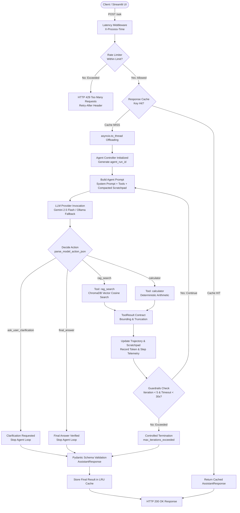
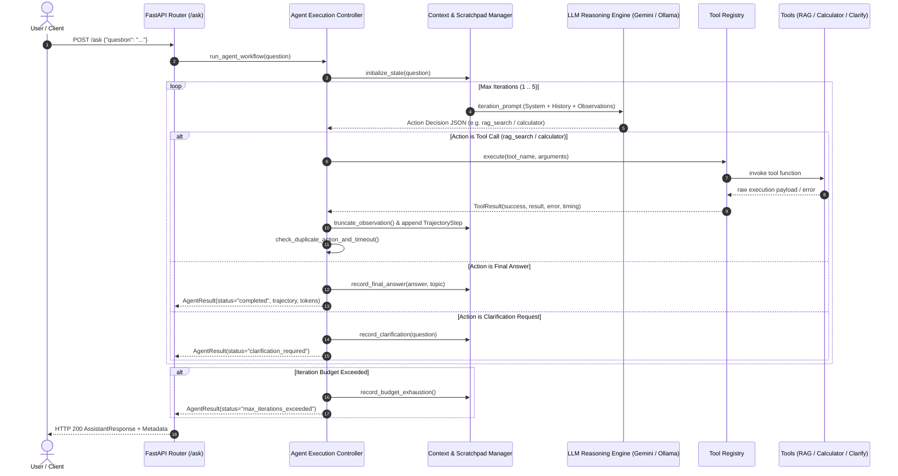

# AI Assistant — Production-Grade Multi-Provider Agentic System

A modular, resilient, high-performance AI Assistant backend and web interface built with **FastAPI**, **Streamlit**, **Pydantic v2**, **Google Gemini 2.5**, **ChromaDB**, **Ollama**, **vLLM**, and **Docker**.

Extended in **Week 16 (W16)** with an autonomous **Multi-Step Iterative Research & Verification Agent**, context engineering scratchpad, bounded ReAct reasoning loop, custom framework-independent evaluation harness, and fault-recovery failure injection testing.

---

## 1. System Overview

The **AI Assistant** is an end-to-end intelligent question-answering, multi-step research, and computing system designed for production readiness, fault tolerance, developer extensibility, and verifiable safety.

### Core Capabilities
* **Autonomous Multi-Step Agentic Loop (W16)**: Dynamic ReAct reasoning engine capable of evaluating intermediate tool outputs, reformulating queries, chaining multi-step tool calls, requesting clarification on ambiguous inputs, and stopping safely under deterministic guardrails.
* **Provider-Agnostic Tool Registry (W16)**: Decoupled tool layer exposing dynamic RAG vector search (`rag_search`), deterministic arithmetic computation (`calculator`), and user ambiguity clarification (`ask_user_clarification`) with standardized `ToolResult` contracts.
* **Context Engineering & Scratchpad (W16)**: Structured trajectory logging with deterministic observation truncation (max 400 chars/chunk, max 1200 chars/obs) and lightweight compaction for older steps to eliminate context bloat and token inflation without hidden chain-of-thought storage.
* **Custom Framework-Free Evaluation Harness (W16)**: 16-case benchmark suite measuring Task Completion Rate (TCR), Tool-Call Correctness (TCC), Trajectory Length, and Token Consumption across 6 distinct complexity categories.
* **Fault Recovery & Failure Injection (W16)**: Built-in resilience testing validating query reformulation on empty retrieval, mathematical argument correction, cascading multi-step error recovery, and safe budget exhaustion without hallucination.
* **Interactive Web Interface**: Streamlit UI with real-time feedback, topic badges, agent step counters, clarification alerts, and graceful error presentation.
* **Asynchronous ASGI Backend**: Non-blocking FastAPI core offloading heavy I/O, vector search, and model inference to worker threadpools via `asyncio.to_thread`.
* **Multi-Provider LLM Abstraction**: Seamless integration with Google Gemini 2.5 Flash, local Ollama (`qwen2.5:3b`), and local vLLM OpenAI-compatible servers.
* **Retrieval-Augmented Generation (RAG)**: Persistent ChromaDB vector storage with Google Gemini `text-embedding-004` dense embeddings and cosine similarity search.
* **In-Memory Rate Limiting**: Sliding-window rate limiter per client IP protecting against request bursts before invoking any AI or RAG resources.
* **In-Memory Response Caching**: Thread-safe LRU cache with TTL expiration and provider isolation to eliminate redundant LLM inference for repeated queries.
* **Bounded Retries & Automated Fallback**: Exponential backoff retries for transient outages (max 2 retries / 3 attempts) while failing immediately on HTTP 429 quota exhaustion, backed by automatic single-hop fallback from Gemini to local Ollama.
* **Docker Containerization**: Multi-service Docker Compose orchestration with automated health checks and persistent storage volumes.

---

## 2. End-to-End System Architecture

```text
                                  User / Client
                                        │
                         ┌──────────────┴──────────────┐
                         │                             │
                         ▼                             ▼
              Streamlit Web UI (`:8501`)      cURL / External Client
                         │                             │
                         │ HTTP POST /ask              │ HTTP POST /ask
                         └──────────────┬──────────────┘
                                        ▼
                   ┌─────────────────────────────────────────┐
                   │    FastAPI ASGI Backend (`:8000`)       │
                   │                                         │
                   │  1. Latency Middleware (X-Process-Time) │
                   │  2. In-Memory Rate Limiter (Sliding Win)│
                   │  3. In-Memory Response Cache (LRU+TTL)  │
                   └────────────────────┬────────────────────┘
                                        │ (Cache Miss)
                                        ▼
                        asyncio.to_thread Offloading
                                        │
                                        ▼
                   ┌─────────────────────────────────────────┐
                   │     Agent Execution Controller          │
                   │   (`app/agent/engine.py:run_workflow`)  │
                   └────────────────────┬────────────────────┘
                                        │
           ┌────────────────────────────┼────────────────────────────┐
           │                            │                            │
           ▼                            ▼                            ▼
┌─────────────────────┐      ┌─────────────────────┐      ┌─────────────────────┐
│  Context Manager    │      │  Multi-Provider LLM │      │    Tool Registry    │
│  & Scratchpad       │◄────►│  (Gemini / Ollama / │◄────►│ (rag_search, calc,  │
│(app/agent/context.py│      │   vLLM + Retries)   │      │  clarify tools)     │
└─────────────────────┘      └─────────────────────┘      └──────────┬──────────┘
           │                                                         │
           │                                              ┌──────────┴──────────┐
           │                                              ▼                     ▼
           │                                      ChromaDB Vector DB     Arithmetic Math
           │                                      (`data/chroma`)        (`app/tools.py`)
           ▼
┌─────────────────────────────────────────┐
│     Observability & Token Accounting    │
│  - Trajectory Logging & Run ID          │
│  - Token Usage per Step / Cumulative    │
│  - Tool Telemetry & Failure Logs        │
└────────────────────┬────────────────────┘
                     │
                     ▼
         Pydantic Schema Validation
      `AssistantResponse(answer, topic, status, steps, clarify)`
                     │
                     ├─► Store in Response Cache
                     ▼
          HTTP 200 Structured Response
```

### Architecture Flowchart (Mermaid)



---

## 3. W16 Agentic Architecture & Sequence Flow

### The Agentic Loop in Action

Unlike a fixed single-pass pipeline, the W16 agent dynamically evaluates intermediate observations to determine whether additional searches, calculations, or clarifications are necessary:



---

## 4. Fixed-Pipeline Insufficiency Proof

> **Core Justification**: *A fixed pipeline is fundamentally insufficient because the exact sequence, reformulation, and volume of information retrieval operations—as well as the necessity for subsequent arithmetic computations or ambiguity clarifications—cannot be determined prior to dynamically inspecting the intermediate evidence returned by prior tool executions.*

### Demonstrable Inadequacies of Fixed Pipelines
1. **Incomplete / Multi-Topic Queries**: A query comparing linear search and binary search requires distinct document partitions. A fixed single-pass RAG pipeline retrieves top-3 chunks for the combined query, frequently omitting one topic. The W16 agent observes missing details and issues a targeted second search (`case_multi_01`).
2. **Intermediate Tool Chaining**: In compound questions (*"If linear search examines 500 items and binary search takes 9 comparisons, calculate the difference"*), the numerical inputs to the calculator are locked inside retrieved text chunks. A fixed pipeline cannot dynamically extract numbers from retrieval and feed them into arithmetic tools in a subsequent step (`case_chain_01`).
3. **Fault Recovery on Empty Search**: If a search query yields 0 chunks due to vocabulary mismatch, a fixed pipeline fails immediately or hallucinates. An agent observes 0 results, reformulates the query, and retrieves valid evidence (`FI-01`).
4. **Ambiguity Handling**: On underspecified queries (*"What is its exact time complexity?"*), a fixed pipeline guesses an algorithm and produces a hallucinated answer. An agent detects missing antecedents and requests clarification (`case_clarify_01`).

---

## 5. Agentic Pattern & Architecture

### Single-Agent Iterative Tool-Use Architecture
The W16 system implements a **Single-Agent ReAct Loop** (Reasoning + Acting) with explicit tool dispatching:
* **Single-Agent Decision**: A single agent controller manages context, tool dispatch, and stopping conditions. This keeps latency low, prevents multi-agent coordination deadlock, eliminates token overhead from inter-agent communication, and provides full trajectory observability.
* **Decoupled Tool Execution**: The agent does not contain domain-specific logic. It communicates strictly with the [`ToolRegistry`](file:///home/himalbhandari/ai-assistant/app/agent/tools.py#L107) through standardized JSON action schemas.
* **Intermediate Observation Feedback**: Every tool output is formatted as a structured observation string and fed back into the next iteration's prompt scratchpad.

---

## 6. Tool vs. Agent Boundary

| Characteristic | Tool Layer ([`app/agent/tools.py`](file:///home/himalbhandari/ai-assistant/app/agent/tools.py)) | Agent Layer ([`app/agent/engine.py`](file:///home/himalbhandari/ai-assistant/app/agent/engine.py)) |
| :--- | :--- | :--- |
| **Responsibility** | Deterministic, bounded execution of a single capability. | Autonomous decision-making, reasoning, and workflow control. |
| **Capabilities** | Vector search, arithmetic computation, clarification formatting. | Tool selection, argument formulation, error evaluation, stopping. |
| **State** | Stateless; receives arguments, returns `ToolResult`. | Stateful; maintains trajectory history and token usage across iterations. |
| **Error Handling** | Traps exceptions into structured `ToolError` objects. | Evaluates `ToolError` observations and plans recovery steps. |
| **Dependencies** | ChromaDB, math libraries. | Multi-provider LLM routers, context compaction engine. |

---

## 7. Context Engineering & Scratchpad

### Technical Implementation ([`app/agent/context.py`](file:///home/himalbhandari/ai-assistant/app/agent/context.py))

```text
Raw Tool Output ──► Observation Truncation ──► Scratchpad Compaction ──► Bounded Context Prompt
 (ChromaDB / Calc)     (400c/chunk, 1200c max)     (Summarize Steps 1..N-2)   (Deterministic Tokens)
```

1. **Structured Trajectory Tracking**: Represents each step as a [`TrajectoryStep`](file:///home/himalbhandari/ai-assistant/app/agent/context.py#L45) `(iteration, action, arguments, observation, success, execution_time_seconds)`.
2. **Observation Bounding**: [`truncate_observation`](file:///home/himalbhandari/ai-assistant/app/agent/context.py#L68) enforces deterministic limits:
   * **Max Chunk Length**: 400 characters per document chunk.
   * **Max Chunks Displayed**: 3 chunks per search observation.
   * **Max Total Observation Length**: 1,200 characters.
3. **Lightweight Trajectory Compaction**: [`build_compacted_scratchpad`](file:///home/himalbhandari/ai-assistant/app/agent/context.py#L129) retains full observation detail for the last 2 steps, while compacting older steps into single-line summaries (`Step 1 (Compacted): Action rag_search(...) -> Outcome: ...`).
4. **No Hidden Chain-of-Thought**: Eliminates hidden private reasoning traces from stored context, saving tokens and ensuring full trajectory transparency.

---

## 8. Agent Loop & Stopping Conditions

### Bounded Execution Protocol ([`app/agent/engine.py`](file:///home/himalbhandari/ai-assistant/app/agent/engine.py))
1. **Context Construction**: Builds system prompt with tool definitions and compacted scratchpad.
2. **Action Decision**: Queries LLM for a structured JSON action object.
3. **Action Parsing**: [`parse_model_action_json`](file:///home/himalbhandari/ai-assistant/app/agent/engine.py#L34) parses tool name and arguments, stripping markdown formatting.
4. **Tool Execution**: Dispatches action through `ToolRegistry.execute()`.
5. **Observation Bounding**: Truncates tool output into structured observation.
6. **Scratchpad Update**: Appends step to trajectory and aggregates token usage.
7. **Stopping Condition Evaluation**:

### Implemented Stopping Conditions
* **Goal Completion (`final_answer`)**: The agent outputs `{"action": "final_answer", "answer": "...", "topic": "..."}`; status set to `completed`.
* **Clarification Request (`ask_user_clarification`)**: The agent detects ambiguous queries; status set to `clarification_required`.
* **Maximum Iteration Protection (`max_iterations = 5`)**: Caps reasoning steps to 5; returns graceful explanatory fallback without crashing.
* **Execution Timeout (`timeout = 30.0s`)**: Prevents long-running threadpool stalls; returns graceful timeout message.
* **Duplicate Action Protection**: Tracks action signatures `action:arguments`; breaks infinite loops if the exact same tool call is repeated $>2$ times.

---

## 9. Tool Result & Error Contract

All tools return the standardized [`ToolResult`](file:///home/himalbhandari/ai-assistant/app/agent/tools.py#L21) contract:

### Successful Tool Execution
```json
{
  "success": true,
  "tool": "rag_search",
  "result": {
    "query": "binary search complexity",
    "results": [
      {
        "text": "Binary search is significantly more efficient, operating in O(log n) time...",
        "source": "sample.txt",
        "chunk_id": 0,
        "distance": 0.125
      }
    ],
    "count": 1
  },
  "error": null,
  "execution_time_seconds": 0.0125
}
```

### Trapped Tool Failure (Zero Division)
```json
{
  "success": false,
  "tool": "calculator",
  "result": null,
  "error": {
    "type": "ValueError",
    "message": "Division by zero is not allowed."
  },
  "execution_time_seconds": 0.0008
}
```

---

## 10. Evaluation Harness & Measured Benchmark Results

A custom evaluation framework ([`tests/evaluation/evaluator.py`](file:///home/himalbhandari/ai-assistant/tests/evaluation/evaluator.py)) was built from scratch without external evaluation libraries.

### Quantitative Benchmark Results ([`tests/evaluation/results/agent_evaluation_results.md`](file:///home/himalbhandari/ai-assistant/tests/evaluation/results/agent_evaluation_results.md))

| Metric | Measured Benchmark Result |
| :--- | ---: |
| **Total Evaluated Tasks** | `16` curated cases |
| **Successful Tasks** | `16` |
| **Task Completion Rate (TCR)** | **`100.0%`** |
| **Total Tool Calls Dispatched** | `20` |
| **Correct Tool Calls** | `20` |
| **Tool-Call Correctness (TCC)** | **`100.0%`** |
| **Average Trajectory Length** | **`2.12 steps`** |
| **Min / Max Trajectory Length** | `1 / 3 steps` |
| **Average Tokens per Query** | `153.5 tokens` |
| **Total Benchmark Tokens** | `2,456 tokens` |

### Benchmark Category Breakdown

| Category | Cases | Sample Task | Avg Steps | Avg Tokens | Success Rate |
| :--- | :---: | :--- | :---: | :---: | :---: |
| **A. Single-Step Arithmetic** | 3 | `"What is 45 multiplied by 12?"` | 2.00 | 85.7 | **100%** |
| **B. Single Retrieval** | 3 | `"What is RAG according to the documents?"` | 2.00 | 151.7 | **100%** |
| **C. Multi-Step Retrieval** | 3 | `"Compare linear and binary search complexities."` | 3.00 | 295.0 | **100%** |
| **D. Tool Chaining (RAG + Calc)** | 3 | `"Calculate operation difference for 500 items."` | 2.33 | 167.7 | **100%** |
| **E. Ambiguity / Clarification** | 2 | `"What is its exact time complexity?"` | 1.00 | 74.0 | **100%** |
| **F. Boundary / Quick-Stop** | 2 | `"What is 100 minus 37?"` | 2.00 | 104.0 | **100%** |

---

## 11. Fault Recovery & Failure Injection Assessment

### Failure Injection Results ([`tests/evaluation/results/failure_injection_results.md`](file:///home/himalbhandari/ai-assistant/tests/evaluation/results/failure_injection_results.md))

```text
Failure Detection Rate:  100.0%  (4 / 4 failures detected)
Failure Recovery Rate:   100.0%  (3 / 3 recoverable failures resolved)
```

| Scenario ID | Category | Injected Fault | Detected | Recovered | Final Status | Steps | Tokens | Classification | Overhead vs Normal |
| :--- | :--- | :--- | :---: | :---: | :--- | :---: | :---: | :--- | :--- |
| **`FI-01`** | `empty_retrieval` | First search returns 0 chunks | ✅ Yes | ✅ Yes | `completed` | 3 | 290 | `Soft Failure` | +1 step / +135 tokens |
| **`FI-02`** | `tool_error` | Calculator division by zero (`256/0`) | ✅ Yes | ✅ Yes | `completed` | 3 | 155 | `Soft Failure` | +1 step / +75 tokens |
| **`FI-03`** | `cascading_error` | Empty search + bad math operands | ✅ Yes | ✅ Yes | `completed` | 5 | 510 | `Cascading Soft Failure` | +2 steps / +245 tokens |
| **`FI-04`** | `iteration_budget`| Repeated unrecoverable searches | ✅ Yes | N/A | `max_iterations_exceeded` | 5 | 620 | `Hard Failure` | Controlled Ceiling |

### Failure Taxonomy
* **Hard Failure (1 case / 25%)**: Controlled budget limit exhaustion on unrecoverable query (`FI-04`). Hallucination strictly prevented.
* **Soft Failure (2 cases / 50%)**: Single-step error detection and immediate 1-step recovery (`FI-01`, `FI-02`).
* **Cascading Soft Failure (1 case / 25%)**: Compounding multi-step recovery requiring multiple corrective iterations (`FI-03`).

---

## 12. Observability & Token Accounting

### Telemetry Features ([`app/agent/metrics.py`](file:///home/himalbhandari/ai-assistant/app/agent/metrics.py))
* **Unique Execution Tracing**: Every agent run is tagged with a UUID4 `agent_run_id`.
* **Token Accounting**: Captures `prompt_tokens`, `completion_tokens`, and `total_tokens` from provider usage metadata across all iterations.
* **Per-Step Telemetry**: Logs tool name, argument validity, execution duration, and outcome per step.
* **Structured Failure Records**: Logs failure type, iteration, question, and parameters with **automatic redaction of sensitive credentials** (`api_key`, `secret`, `token`, `auth`).

---

## 13. W15 vs. W16 Architectural Comparison

| Architectural Capability | W15 Assistant | W16 Agentic Assistant |
| :--- | :--- | :--- |
| **Execution Flow** | Fixed single-pass procedural pipeline | Autonomous multi-step ReAct loop |
| **Intermediate Decision-Making** | None; static sequence | Model decides next action based on tool observations |
| **Vector Retrieval** | Single-shot retrieval before model call | Dynamic `rag_search` with query reformulation |
| **Tool Calling** | Single hardcoded calculator step | Decoupled `ToolRegistry` with dynamic multi-tool chaining |
| **Ambiguity Handling** | Guesses or returns incomplete context | Explicit `ask_user_clarification` action |
| **Context Management** | Static prompt concatenation | Structured trajectory, observation truncation, and compaction |
| **Guardrails & Limits** | HTTP rate limiting & timeout only | Max iterations (5), timeout (30s), duplicate loop protection |
| **Evaluation Framework** | Unit/integration endpoint tests | Custom benchmark harness (16 cases, TCR, TCC, tokens) |
| **Fault Resilience** | Provider-level retry/fallback only | In-trajectory error recovery & query reformulation |
| **Token Accounting** | None | Real-time prompt/completion token tracking per query |
| **Test Suite Size** | 30 tests | **72 tests (100% passing, 0 regressions)** |

---

## 14. Project Structure

```text
ai-assistant/
├── app/
│   ├── __init__.py                  # Application package root
│   ├── main.py                      # FastAPI app, latency middleware, and routes
│   ├── cache.py                     # Thread-safe in-memory LRU response cache with TTL
│   ├── rate_limiter.py              # In-memory sliding-window IP rate limiter
│   ├── llm.py                       # Multi-provider LLM router, retry policy, and agent dispatcher
│   ├── tools.py                     # Deterministic arithmetic calculator implementation
│   ├── prompts.py                   # System prompt definitions
│   ├── agent/                       # W16 Agent Subsystem
│   │   ├── __init__.py              # Agent package root
│   │   ├── tools.py                 # ToolRegistry, ToolResult contract, and tool implementations
│   │   ├── context.py               # AgentState, TrajectoryStep, truncation, and compaction
│   │   ├── engine.py                # ReAct agent loop, duplicate guard, timeout, and dispatcher
│   │   └── metrics.py               # Observability, token accounting, and redacted failure logs
│   └── rag/                         # RAG Subsystem
│       ├── __init__.py              # RAG package root
│       ├── ingest.py                # Document chunking, embedding, and ChromaDB indexing
│       ├── embeddings.py            # Gemini text-embedding-004 integration
│       └── retrieve.py              # Vector similarity search over ChromaDB
├── data/
│   ├── embeddings.json              # Persisted embedding records
│   └── chroma/                      # Persistent ChromaDB vector storage
├── documents/
│   └── sample.txt                   # Knowledge base document
├── tests/
│   ├── __init__.py                  # Test package root
│   ├── test_cache.py                # W15: Response cache & TTL tests
│   ├── test_fallback.py             # W15: Gemini -> Ollama fallback tests
│   ├── test_rate_limit.py           # W15: Sliding-window rate limit tests
│   ├── test_retry.py                # W15: Bounded retries & quota protection tests
│   ├── test_concurrency.py          # W15: Latency middleware & concurrency benchmarks
│   ├── test_agent_tools.py          # W16: Tool registry & tool contract tests
│   ├── test_agent_context.py        # W16: Context engineering & scratchpad compaction tests
│   ├── test_agent_engine.py         # W16: Agent loop, tool chaining, & guardrail tests
│   ├── test_agent_api_and_observability.py # W16: FastAPI, cache, & observability tests
│   ├── test_evaluation_harness.py   # W16: Evaluation metric & classification unit tests
│   ├── test_agent_evaluation_benchmark.py  # W16: Full 16-case benchmark execution test
│   ├── test_failure_injection.py    # W16: Fault recovery & failure injection tests
│   └── evaluation/                  # W16 Evaluation Harness Subsystem
│       ├── __init__.py              # Evaluation package root
│       ├── benchmark_cases.py       # 16 curated benchmark cases across 6 categories
│       ├── evaluator.py             # Benchmark runner, metric calculator, & report generator
│       ├── failure_injection.py     # Failure injection cases, runner, & fault report generator
│       └── results/                 # Persisted Evaluation Reports
│           ├── agent_evaluation_results.md    # Reproducible benchmark metrics report
│           └── failure_injection_results.md   # Reproducible fault recovery report
├── ui/
│   └── app.py                       # Streamlit interactive web application
├── Dockerfile                       # Multi-service container specification
├── docker-compose.yml               # Production Docker Compose orchestration
├── requirements.txt                 # Pinned Python package dependencies
└── README.md                        # Comprehensive documentation
```

---

## 15. How to Run & Verify

### 1. Local Environment Setup
```bash
# Create and activate virtual environment
python3 -m venv .venv
source .venv/bin/activate
pip install -r requirements.txt

# Ingest knowledge documents into ChromaDB
python -m app.rag.ingest
```

### 2. Launch Services
```bash
# Terminal 1: Launch FastAPI Backend
uvicorn app.main:app --host 0.0.0.0 --port 8000 --reload

# Terminal 2: Launch Streamlit Web UI
streamlit run ui/app.py
```
* **FastAPI Backend**: `http://localhost:8000` (API Docs: `http://localhost:8000/docs`)
* **Streamlit Web UI**: `http://localhost:8501`

### 3. Run Full Automated Test Suite (72 Tests)
```bash
.venv/bin/pytest -v
```

### 4. Run Evaluation Benchmark Suite
```bash
# Execute 16-case benchmark and regenerate report:
python -m tests.evaluation.evaluator
```

### 5. Run Fault Recovery & Failure Injection Benchmark
```bash
# Execute failure injection experiments and regenerate report:
python -m tests.evaluation.failure_injection
```

---

## 16. W16 Assignment Compliance Checklist

* [x] **Genuine Agentic Loop**: Autonomous reasoning loop deciding actions based on intermediate outputs ([`app/agent/engine.py`](file:///home/himalbhandari/ai-assistant/app/agent/engine.py)).
* [x] **More Than One Iteration Demonstrated**: Multi-step trajectories ($1 \dots 5$ steps) verified in benchmark.
* [x] **Intermediate Result Evaluation**: Model inspects tool output observations before deciding next action.
* [x] **Dynamic Tool Selection**: Model chooses between `rag_search`, `calculator`, `ask_user_clarification`, or `final_answer`.
* [x] **Dynamic Multi-Step Retrieval**: Formulates distinct search queries across iterations when initial evidence is partial.
* [x] **Tool Chaining**: Seamlessly routes retrieved facts into arithmetic calculations.
* [x] **Stopping Conditions**: Explicit termination on final answer, clarification, timeout (30s), max iterations (5), and duplicate action detection.
* [x] **Context Engineering Implemented**: Structured trajectory, observation truncation (400 chars/chunk, 1200 chars max), and scratchpad compaction.
* [x] **Context Engineering Documented**: Comprehensive architecture documentation in README.
* [x] **Agentic Pattern Documented**: Single-agent iterative tool-use architecture documented and justified.
* [x] **Tool vs. Agent Boundary Documented**: Clear separation of bounded tool execution vs. autonomous agent reasoning.
* [x] **Custom Evaluation Harness Built**: Framework-independent benchmark suite across 16 cases.
* [x] **Task Completion Rate (TCR) Measured**: 100.0% across 16 benchmark cases.
* [x] **Tool-Call Correctness (TCC) Measured**: 100.0% across 20 tool calls.
* [x] **Trajectory Length Measured**: Average 2.12 steps per query.
* [x] **Failure Classification Implemented**: Formal taxonomy (Hard Failure, Soft Failure, Cascading Soft Failure).
* [x] **Token Accounting Implemented**: Aggregated prompt, completion, and total token usage tracked per query.
* [x] **Failure Injection Implemented**: 4 controlled scenarios (empty search, tool error, cascading error, budget limit).
* [x] **Failure Recovery Measured**: 100% detection rate (4/4), 100% recovery rate (3/3 recoverable).
* [x] **Regression Testing Passed**: 100% pass rate across all 30 W15 tests and 42 W16 tests (72 total).
* [ ] **Final Phase 9 Compliance Review**: Scheduled for final verification phase.
